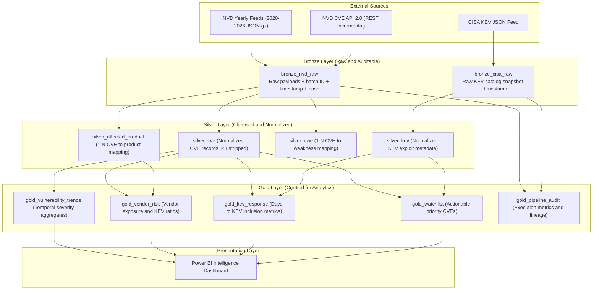

# VulnPulse: Cyber Vulnerability Intelligence Lakehouse

An automated Apache Spark data engineering pipeline based on the Medallion Architecture (Lakehouse), ingesting and normalizing vulnerability intelligence from the National Vulnerability Database (NVD) and CISA Known Exploited Vulnerabilities (KEV) catalog.

[](https://github.com/kashishfatima999/VulnPulse/actions/workflows/phase1_validation.yml)
[](LICENSE)
[](https://databricks.com/)
[](https://spark.apache.org/)
[](https://powerbi.microsoft.com/)
[](docs/Phase1_Proposal.pdf)

---

**Authors:** Kashish Fatima & Zahra Saeed  
**Project Proposal Document:** [docs/Phase1_Proposal.pdf](docs/Phase1_Proposal.pdf)  
**Technical Documentation:** [docs/ARCHITECTURE.md](docs/ARCHITECTURE.md) | [docs/FINOPS.md](docs/FINOPS.md)  
**Repository:** [https://github.com/kashishfatima999/VulnPulse](https://github.com/kashishfatima999/VulnPulse)  

---

## Executive Summary

VulnPulse is an end-to-end data platform designed to process cybersecurity vulnerability intelligence using distributed computing. Modern analytical systems require reliable baseline history, automated incremental ingestion, schema normalization, and enrichment with active exploitation signals.

The system ingests vulnerability baselines and updates from the National Institute of Standards and Technology (NIST) National Vulnerability Database (NVD) and cross-references them against the Cybersecurity and Infrastructure Security Agency (CISA) Known Exploited Vulnerabilities (KEV) catalog. The pipeline transforms raw nested JSON payloads across Bronze, Silver, and Gold layers to power business intelligence dashboards in Power BI.

---

## Phase 1 Rubric Compliance Matrix

This repository and the formal proposal satisfy all six Phase 1 requirements:

| Requirement | Implementation Summary | Primary Reference |
|---|---|---|
| **1. Domain and Source Identification** | Cybersecurity vulnerability intelligence. Primary source: NIST NVD 2.0 JSON feeds and REST API. Enrichment: CISA KEV JSON catalog. Full load via yearly archives (2020-2026); incremental load via watermark-filtered REST API queries. | [Phase1_Proposal.pdf (Sections 1-4)](docs/Phase1_Proposal.pdf) |
| **2. Data Samples and Volume** | Authentic API sample extracts for both load patterns stored in `data/`. Baseline historical volume estimated at ~132 MiB compressed; incremental updates estimated at sub-MB to low single-digit MB daily. | [`data/`](data/) and [Phase1_Proposal.pdf (Section 5)](docs/Phase1_Proposal.pdf) |
| **3. Security and Compliance** | Identified email addresses occasionally present in NVD `sourceIdentifier`. Masking/dropping strategy defined for Silver/Gold layers with boolean retention. API credentials isolated in environment variables. | [Phase1_Proposal.pdf (Section 6)](docs/Phase1_Proposal.pdf) and [FINOPS.md](docs/FINOPS.md) |
| **4. Medallion Data Modeling** | Bronze raw ingestion with audit lineage; Silver normalized tables (`silver_cve`, `silver_affected_product`, `silver_cwe`, `silver_kev`); Gold analytical star/aggregate models. | [Phase1_Proposal.pdf (Section 7)](docs/Phase1_Proposal.pdf) and [ARCHITECTURE.md](docs/ARCHITECTURE.md) |
| **5. Business Intelligence and Dashboards** | Designed for Power BI. Addresses five analytical questions regarding severity evolution, vendor risk, exploit response timing, and remediation watchlists with five planned visual charts. | [Phase1_Proposal.pdf (Section 8)](docs/Phase1_Proposal.pdf) |
| **6. Engineering Setup and FinOps** | Public GitHub repository, Databricks Free Edition guardrails, storage cap below 2.0 GB, watermark-driven compute savings, automated CI validation gate, and MIT license. | [Phase1_Proposal.pdf (Sections 9-10)](docs/Phase1_Proposal.pdf) and [FINOPS.md](docs/FINOPS.md) |

---

## Architecture Overview



---

## Data Sources and Ingestion Patterns

### 1. Full Load Baseline
- **Source:** NIST NVD 2.0 Yearly JSON Feeds (`nvdcve-2.0-{YEAR}.json.gz`).
- **Baseline Window:** 2020 through 2026.
- **Estimated Compressed Size:** Approximately 131.5 MiB across the multi-year baseline.
- **Role:** Establishes the initial historical dataset during platform setup.

### 2. Incremental Load
- **Source:** NIST NVD CVE API 2.0 (`https://services.nvd.nist.gov/rest/json/cves/2.0`).
- **Mechanism:** Filtered queries using `lastModStartDate` and `lastModEndDate` UTC timestamps.
- **Frequency:** Daily batches capturing newly published or modified CVE records.
- **Watermarking:** The pipeline persists the maximum `lastModified` timestamp from each batch into `gold_pipeline_audit`. Subsequent queries use a 10-minute overlap window to prevent data loss, with deduplication handled in Silver.

### 3. Enrichment Source
- **Source:** CISA Known Exploited Vulnerabilities (KEV) Catalog JSON feed.
- **Volume:** Approximately 1,700 records (~1.7 MB uncompressed).
- **Role:** Joined on `cve_id` to provide active exploitation status, ransomware association, and federal action deadlines.

---

## Security, PII Governance and FinOps

### PII Handling Strategy
Public vulnerability databases do not intentionally contain user personal data. However, the NVD `sourceIdentifier` field can contain email addresses representing submitter attribution. 
- In the Silver layer, incoming `sourceIdentifier` values matching email patterns are sanitized and dropped from analytical tables.
- A boolean flag (`has_source_identifier`) is retained for lineage accounting without exposing contact details.
- API keys are managed through environment variables or Databricks Secrets; no credentials exist in source control.

### FinOps and Resource Guardrails
The pipeline is designed to operate safely within Databricks Free Edition quotas:
- **No Big Data in Git:** Full yearly archives are excluded via `.gitignore`; only verifiable raw samples (<100 KB) are versioned in Git.
- **Watermark-Driven Compute:** Incremental batches avoid reprocessing the 130+ MiB baseline, reducing cluster runtime and memory overhead.
- **Persistent Storage Limit:** Staging files are purged once ingested into Unity Catalog Delta tables, keeping overall project storage below a 2.0 GB ceiling.

---

## Repository Structure

```text
VulnPulse/
├── .github/
│   └── workflows/
│       └── phase1_validation.yml     # Automated CI data and deliverable validation
├── data/
│   ├── README.md                     # Sample data documentation and rationale
│   ├── cisa_kev_sample.json          # 10 authentic CISA KEV catalog records
│   ├── nvd_full_load_sample.json     # 10 records from NVD baseline feed
│   ├── nvd_incremental_load_sample.json # 10 records from 24-hr watermark query
│   └── source_manifest.json          # Record counts, API URLs, and SHA-256 hashes
├── docs/
│   ├── Phase1_Proposal.pdf           # Formal Phase 1 proposal document
│   ├── ARCHITECTURE.md               # Technical Lakehouse and schema specifications
│   └── FINOPS.md                     # Resource optimization and security guardrails
├── scripts/
│   └── collect_phase1_samples.py     # Python collector to reproduce sample extracts
├── .gitattributes                    # Line ending normalization (LF)
├── .gitignore                        # Git exclusion rules for large datasets and caches
├── LICENSE                           # MIT License
└── README.md                         # Project documentation and landing page
```

---

## Sample Data and Verification

The `data/` directory contains authentic, non-fabricated sample files captured from live endpoints:
- `nvd_full_load_sample.json`: Representative payload for historical baseline ingestion.
- `nvd_incremental_load_sample.json`: Representative payload for watermark-based incremental queries.
- `cisa_kev_sample.json`: Representative payload for enrichment joins.
- `source_manifest.json`: Full provenance tracking, including capture timestamp, source URLs, record counts, and SHA-256 digests.

### Reproducing Sample Collection
To regenerate or verify the sample payloads directly from NIST and CISA endpoints:
```bash
python scripts/collect_phase1_samples.py
```

---

## Project Execution Plan

- **Phase 1 (Completed):** Proposal document, domain and source identification, sample payloads, Medallion architecture model, FinOps plan, and repository initialization.
- **Phase 2:** Automated ingestion pipeline in Apache Spark (Databricks), Bronze and Silver transformations, incremental watermarking, and data-quality validation.
- **Phase 3:** Gold aggregate tables, Power BI business intelligence dashboard, and final documentation.

---

## License

This project is licensed under the MIT License - see the [LICENSE](LICENSE) file for details.
