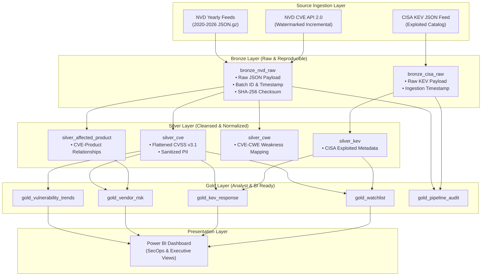

<div align="center">

# 🛡️ VulnPulse
### Cyber Vulnerability Intelligence Lakehouse
**An End-to-End Automated Data Engineering Pipeline on Apache Spark & Medallion Architecture**

[](https://github.com/kashishfatima999/VulnPulse/actions/workflows/phase1_validation.yml)
[](LICENSE)
[](https://databricks.com/)
[](https://spark.apache.org/)
[](https://powerbi.microsoft.com/)
[](docs/Phase1_Proposal.pdf)

---

**Team:** Kashish Fatima & Zahra Saeed | **Course:** Data Analysis and Visualization / Data Engineering

[📄 Read Phase 1 Proposal (PDF)](docs/Phase1_Proposal.pdf) • [🏗️ Architecture Specs](docs/ARCHITECTURE.md) • [🌐 Data Sources](docs/DATA_SOURCES.md) • [🔒 PII & FinOps](docs/PII_FINOPS.md) • [✅ Rubric Checklist](docs/PHASE1_CHECKLIST.md)

</div>

---

## 📌 Executive Summary

Organizations are bombarded by security vulnerability disclosures from multiple disparate sources. A robust analytical platform must distinguish historical baselines from newly disclosed or updated records, normalize deep nested JSON schemas, and prioritize vulnerabilities known to be actively exploited by adversaries in the wild.

**VulnPulse** is a storage-aware, automated cybersecurity data engineering pipeline built using **Apache Spark** and the **Medallion Architecture (Lakehouse)**. It unifies baseline vulnerability archives from the **National Vulnerability Database (NVD)**, processes incremental updates via the **NVD REST API 2.0**, and joins exploitation telemetry from the **CISA Known Exploited Vulnerabilities (KEV)** catalog. The curated outputs power an executive security intelligence dashboard in **Power BI**.

---

## 🎯 Phase 1 Rubric Compliance Matrix

All 6 requirements specified in the project guidelines are fulfilled in this repository:

| # | Instructor Requirement | Implementation Details | Evidence & Deliverable |
|---|---|---|---|
| **1** | **Domain & Source Identification** | Cybersecurity Vulnerability Intelligence; dual-source pipeline integrating NIST NVD and CISA KEV. Supports full baseline ingestion and watermarked incremental loads. | [Proposal PDF (Sec. 1–4)](docs/Phase1_Proposal.pdf)<br>[DATA_SOURCES.md](docs/DATA_SOURCES.md) |
| **2** | **Data Samples & Volume** | Real, non-fabricated payloads captured from live APIs with SHA-256 hashes recorded in provenance manifest. Full historical volume (~132 MiB) and daily incremental (< 5 MiB) estimated. | [data/samples/](data/samples/)<br>[source_manifest.json](data/samples/source_manifest.json) |
| **3** | **Security & Compliance** | Thorough PII assessment; explicit detection and stripping strategy for email addresses appearing in NVD `sourceIdentifier`. Zero credential leakage policy. | [PII_FINOPS.md](docs/PII_FINOPS.md)<br>[Proposal PDF (Sec. 6)](docs/Phase1_Proposal.pdf) |
| **4** | **Medallion Data Modeling** | Bronze raw layer with audit metadata; Silver normalized relational entities (`silver_cve`, `silver_affected_product`, `silver_kev`); Gold analytical star/aggregate models. | [ARCHITECTURE.md](docs/ARCHITECTURE.md)<br>[Proposal PDF (Sec. 7)](docs/Phase1_Proposal.pdf) |
| **5** | **Business Intelligence** | Answers 5 operational security questions with 5 planned visuals (severity trend lines, vendor exposure ranking, exploit response latency, CWE heatmap, watchlist). | [Proposal PDF (Sec. 8)](docs/Phase1_Proposal.pdf)<br>[ARCHITECTURE.md](docs/ARCHITECTURE.md) |
| **6** | **Engineering & FinOps** | Public GitHub repo with reproducible Python collector, CI/CD data gate, MIT license, and Databricks Free Edition storage guardrails (< 2 GB target). | [.github/workflows/](.github/workflows/)<br>[PII_FINOPS.md](docs/PII_FINOPS.md) |

---

## 🏗️ Medallion Architecture



---

## 📂 Repository Structure

```text
VulnPulse/
├── .github/
│   └── workflows/
│       └── phase1_validation.yml   # CI/CD: Automated JSON & hash verification
├── config/
│   └── config.example.yaml        # Pipeline parameters & Databricks volume templates
├── data/
│   ├── README.md                  # Data overview and reproduction guide
│   └── samples/                   # Phase 1 small evidence payloads
│       ├── nvd_full_load_sample.json         # 10 records from NVD baseline
│       ├── nvd_incremental_load_sample.json  # 10 records from 24-hr watermark query
│       ├── cisa_kev_sample.json              # 10 records from CISA KEV catalog
│       └── source_manifest.json              # SHA-256 hashes & API URLs
├── docs/
│   ├── Phase1_Proposal.pdf        # Formal Phase 1 proposal document
│   ├── Phase1_Proposal.docx       # Proposal source document
│   ├── ARCHITECTURE.md            # Detailed Lakehouse & table schemas
│   ├── DATA_SOURCES.md            # NIST NVD & CISA KEV feed specifications
│   ├── PII_FINOPS.md              # Security, privacy & Databricks FinOps policy
│   └── PHASE1_CHECKLIST.md        # Rubric compliance checklist
├── scripts/
│   └── collect_phase1_samples.py  # Python utility to pull & verify live samples
├── .gitignore                     # Git exclusion rules for large datasets & caches
├── LICENSE                        # MIT License
└── README.md                      # Project landing page
```

---

## 🔬 Data Samples & Verification

The repository contains real sample excerpts from both sources:
- **`nvd_full_load_sample.json`**: 10 records representing the baseline NVD JSON structure.
- **`nvd_incremental_load_sample.json`**: 10 records captured using `lastModStartDate` / `lastModEndDate` query parameters representing a 24-hour modified window.
- **`cisa_kev_sample.json`**: 10 records representing active exploitation records.
- **`source_manifest.json`**: Full provenance including timestamps, source request URLs, record counts, and SHA-256 digests.

### Reproducing Sample Collection
To re-run the collector script and verify live API responses:
```bash
# Optional: export NVD_API_KEY="your-api-key"
python scripts/collect_phase1_samples.py
```

---

## 🔒 Security & PII Handling

NVD CVE records can contain submitter contact information in `sourceIdentifier` (frequently formatted as corporate or personal email addresses). VulnPulse enforces:
1. **Automated Stripping**: Email patterns are dropped during Silver transformation.
2. **Provenance Boolean**: A flag `has_source_identifier` is preserved for lineage without leaking personal contacts.
3. **Secret Isolation**: Databricks Secret Scopes manage API tokens; no keys are stored in source control.

---

## 💰 FinOps & Storage Guardrails

To operate sustainably on **Databricks Free Edition**:
- **No Large Files in GitHub**: Full baseline feeds (~132 MiB) are excluded via `.gitignore`; only verifiable samples (<100 KB) are versioned.
- **Watermarking**: Incremental pipelines fetch only delta changes to eliminate full history recomputation.
- **2.0 GB Storage Cap**: Transitory staging files are purged once ingested into Unity Catalog Delta tables.
- **Cluster Efficiency**: Processing scales through sample validation $\rightarrow$ 1-year partitions $\rightarrow$ full multi-year baseline.

---

## 👥 Authors

- **Kashish Fatima** ([GitHub: @kashishfatima999](https://github.com/kashishfatima999))
- **Zahra Saeed**

*Prepared for Phase 1 Submission | Design Baseline: Fall 2026*
