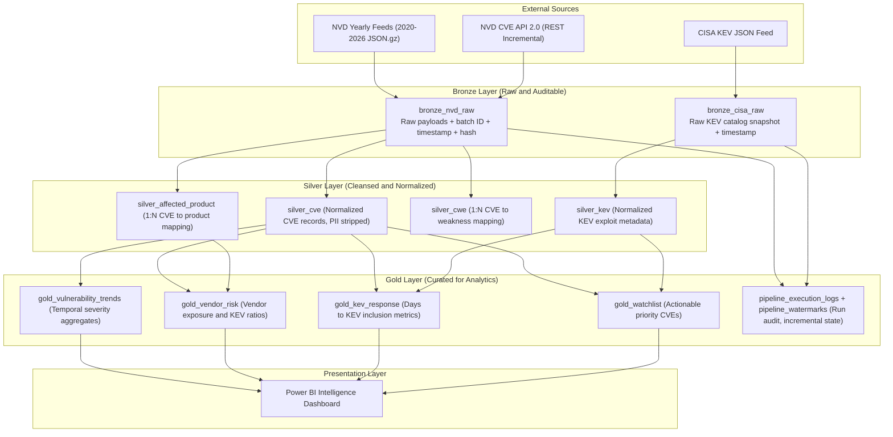

# VulnPulse: Cyber Vulnerability Intelligence Lakehouse

An automated Apache Spark data engineering pipeline based on the Medallion Architecture (Lakehouse), ingesting and normalizing vulnerability intelligence from the National Vulnerability Database (NVD) and CISA Known Exploited Vulnerabilities (KEV) catalog.

[](https://github.com/kashishfatima999/VulnPulse/actions/workflows/ci.yml)
[](LICENSE)
[](https://databricks.com/)
[](https://spark.apache.org/)
[](https://powerbi.microsoft.com/)
[](docs/24L-2605%2624L-2512-VulnPulse_Phase1_Proposal.pdf)

---

**Authors:** Kashish Fatima & Zahra Saeed  
**Project Proposal Document:** [docs/24L-2605&24L-2512-VulnPulse_Phase1_Proposal.pdf](docs/24L-2605%2624L-2512-VulnPulse_Phase1_Proposal.pdf)  
**Technical Documentation:** [docs/ARCHITECTURE.md](docs/ARCHITECTURE.md) | [docs/FINOPS.md](docs/FINOPS.md)  
**Repository:** [https://github.com/kashishfatima999/VulnPulse](https://github.com/kashishfatima999/VulnPulse)  

---

## Executive Summary

VulnPulse is an end-to-end data platform designed to process cybersecurity vulnerability intelligence using distributed computing. Modern analytical systems require reliable baseline history, automated incremental ingestion, schema normalization, and enrichment with active exploitation signals.

The system ingests vulnerability baselines and updates from the National Institute of Standards and Technology (NIST) National Vulnerability Database (NVD) and cross-references them against the Cybersecurity and Infrastructure Security Agency (CISA) Known Exploited Vulnerabilities (KEV) catalog. The pipeline transforms raw nested JSON payloads across Bronze, Silver, and Gold layers to power business intelligence dashboards in Power BI.

---

## Phase 1 Rubric Compliance Matrix

This repository and the formal proposal satisfy all six Phase 1 requirements:

| Requirement | Implementation Summary | Primary Reference |
|---|---|---|
| **1. Domain and Source Identification** | Cybersecurity vulnerability intelligence. Primary source: NIST NVD 2.0 JSON feeds and REST API. Enrichment: CISA KEV JSON catalog. Full load via yearly archives (2020-2026); incremental load via watermark-filtered REST API queries. | [Proposal PDF (Sections 1-4)](docs/24L-2605%2624L-2512-VulnPulse_Phase1_Proposal.pdf) |
| **2. Data Samples and Volume** | Authentic API sample extracts for both load patterns stored in `data/`. Baseline historical volume estimated at ~132 MiB compressed; incremental updates estimated at sub-MB to low single-digit MB daily. | [`data/`](data/) and [Proposal PDF (Section 5)](docs/24L-2605%2624L-2512-VulnPulse_Phase1_Proposal.pdf) |
| **3. Security and Compliance** | Identified email addresses occasionally present in NVD `sourceIdentifier`. Masking/dropping strategy defined for Silver/Gold layers with boolean retention. API credentials isolated in environment variables. | [Proposal PDF (Section 6)](docs/24L-2605%2624L-2512-VulnPulse_Phase1_Proposal.pdf) and [FINOPS.md](docs/FINOPS.md) |
| **4. Medallion Data Modeling** | Bronze raw ingestion with audit lineage; Silver normalized tables (`silver_cve`, `silver_affected_product`, `silver_cwe`, `silver_kev`); Gold analytical star/aggregate models. | [Proposal PDF (Section 7)](docs/24L-2605%2624L-2512-VulnPulse_Phase1_Proposal.pdf) and [ARCHITECTURE.md](docs/ARCHITECTURE.md) |
| **5. Business Intelligence and Dashboards** | Designed for Power BI. Addresses five analytical questions regarding severity evolution, vendor risk, exploit response timing, and remediation watchlists with five planned visual charts. | [Proposal PDF (Section 8)](docs/24L-2605%2624L-2512-VulnPulse_Phase1_Proposal.pdf) |
| **6. Engineering Setup and FinOps** | Public GitHub repository, Databricks Free Edition guardrails, storage cap below 2.0 GB, watermark-driven compute savings, automated CI validation gate, and MIT license. | [Proposal PDF (Sections 9-10)](docs/24L-2605%2624L-2512-VulnPulse_Phase1_Proposal.pdf) and [FINOPS.md](docs/FINOPS.md) |

---

## Architecture Overview


```mermaid
flowchart TD
    subgraph Sources ["External Sources"]
        NVD_Full["NVD Yearly Feeds (2020-2026 JSON.gz)"]
        NVD_Inc["NVD CVE API 2.0 (REST Incremental)"]
        CISA_Feed["CISA KEV JSON Feed"]
    end

    subgraph Bronze ["Bronze Layer (Raw and Auditable)"]
        B_NVD["bronze_nvd_raw<br/>Raw payloads + batch ID + timestamp + hash"]
        B_CISA["bronze_cisa_raw<br/>Raw KEV catalog snapshot + timestamp"]
    end

    subgraph Silver ["Silver Layer (Cleansed and Normalized)"]
        S_CVE["silver_cve (Normalized CVE records, PII stripped)"]
        S_Prod["silver_affected_product (1:N CVE to product mapping)"]
        S_CWE["silver_cwe (1:N CVE to weakness mapping)"]
        S_KEV["silver_kev (Normalized KEV exploit metadata)"]
    end

    subgraph Gold ["Gold Layer (Curated for Analytics)"]
        G_Trend["gold_vulnerability_trends (Temporal severity aggregates)"]
        G_Vendor["gold_vendor_risk (Vendor exposure and KEV ratios)"]
        G_KEV_Resp["gold_kev_response (Days to KEV inclusion metrics)"]
        G_Watch["gold_watchlist (Actionable priority CVEs)"]
        G_Audit["pipeline_execution_logs + pipeline_watermarks (Run audit, incremental state)"]
    end

    subgraph BI ["Presentation Layer"]
        PowerBI["Power BI Intelligence Dashboard"]
    end

    NVD_Full --> B_NVD
    NVD_Inc --> B_NVD
    CISA_Feed --> B_CISA

    B_NVD --> S_CVE
    B_NVD --> S_Prod
    B_NVD --> S_CWE
    B_CISA --> S_KEV

    S_CVE --> G_Trend
    S_CVE & S_Prod --> G_Vendor
    S_CVE & S_KEV --> G_KEV_Resp
    S_CVE & S_KEV --> G_Watch
    B_NVD & B_CISA --> G_Audit

    G_Trend --> PowerBI
    G_Vendor --> PowerBI
    G_KEV_Resp --> PowerBI
    G_Watch --> PowerBI
```

---

## Data Sources and Ingestion Patterns

### 1. Full Load Baseline
- **Source:** NIST NVD 2.0 Yearly JSON Feeds (`nvdcve-2.0-{YEAR}.json.gz`).
- **Baseline Window:** 2020 through 2026.
- **Estimated Compressed Size:** Approximately 131.5 MiB across the multi-year baseline.
- **Role:** Establishes the initial historical dataset during platform setup.

### 2. Incremental Load
- **Source:** NIST NVD CVE API 2.0 (`https://services.nvd.nist.gov/rest/json/cves/2.0`).
- **Mechanism:** Filtered queries using `lastModStartDate` and `lastModEndDate` UTC timestamps.
- **Frequency:** Daily batches capturing newly published or modified CVE records.
- **Watermarking:** After each successful INCREMENTAL run the maximum source `lastModified` is appended to `pipeline_watermarks`. The next run queries from that value minus a 10-minute overlap to the current time; the duplicates the overlap creates are harmless in append-only Bronze and removed by Silver's `MERGE INTO`. BACKFILL runs use an explicit window and never move the watermark.

### 3. Enrichment Source
- **Source:** CISA Known Exploited Vulnerabilities (KEV) Catalog JSON feed.
- **Volume:** Approximately 1,700 records (~1.7 MB uncompressed).
- **Role:** Joined on `cve_id` to provide active exploitation status, ransomware association, and federal action deadlines.

---

## Security, PII Governance and FinOps

### PII Handling Strategy
Public vulnerability databases do not intentionally contain user personal data. However, the NVD `sourceIdentifier` field can contain email addresses representing submitter attribution. 
- In the Silver layer, incoming `sourceIdentifier` values matching email patterns are sanitized and dropped from analytical tables.
- A boolean flag (`has_source_identifier`) is retained for lineage accounting without exposing contact details.
- API keys are managed through environment variables or Databricks Secrets; no credentials exist in source control.

### FinOps and Resource Guardrails
The pipeline is designed to operate safely within Databricks Free Edition quotas:
- **No Big Data in Git:** Full yearly archives are excluded via `.gitignore`; only verifiable raw samples (<100 KB) are versioned in Git.
- **Watermark-Driven Compute:** Incremental batches avoid reprocessing the 130+ MiB baseline, reducing cluster runtime and memory overhead.
- **Persistent Storage Limit:** Staging files are purged once ingested into Unity Catalog Delta tables, keeping overall project storage below a 2.0 GB ceiling.

---

## Repository Structure

Only files under `notebooks/` are ever executed. Everything else is imported by them, tested by CI,
or read by people.

```text
VulnPulse/
├── .github/workflows/
│   └── ci.yml                        # CI on every PR: ruff lint, pytest (local PySpark), sample integrity
├── notebooks/                        # Thin Databricks notebooks (source format). RUN THESE.
│   ├── 00_setup_catalog.py           # Once: creates vulnpulse_bronze/silver/gold schemas + landing volume
│   ├── 01_bronze_nvd.py              # Raw-to-Bronze NVD: FULL / INCREMENTAL / BACKFILL via widgets
│   └── 02_bronze_kev.py              # Raw-to-Bronze CISA KEV: full snapshot of the live catalog
├── src/vulnpulse/                    # Production code, imported by notebooks and tests. Never run directly.
│   ├── schemas/
│   │   ├── nvd.py                    # Explicit StructTypes for NVD pages (raw envelope) and typed CVE records
│   │   └── kev.py                    # Explicit StructTypes for the CISA KEV catalog and records
│   ├── ingestion/
│   │   └── nvd_api.py                # NVD API 2.0 client: windows, pagination, retry, rate-limit pauses
│   ├── bronze/
│   │   ├── nvd.py                    # Read NVD files, one row per CVE, attach metadata, append to Delta
│   │   └── kev.py                    # Download KEV catalog, one row per entry, append to Delta
│   ├── audit/
│   │   └── execution_log.py          # pipeline_execution_logs table: one row per run per layer
│   └── utils/
│       ├── params.py                 # Validated run parameters (load_type, dates, batch_id, catalog)
│       └── watermark.py              # pipeline_watermarks table and incremental window logic
├── tests/                            # pytest suite; run locally and in CI, never in Databricks
│   ├── conftest.py                   # Local SparkSession fixture, sample data path
│   ├── test_bronze_nvd.py            # Raw preservation, Bronze schema, hash stability, typed parse
│   ├── test_schemas_kev.py           # KEV envelope + typed record schema
│   ├── test_params_and_log.py        # Parameter validation, execution-log row construction
│   ├── test_nvd_api.py               # Pagination, 120-day chunking, retry/backoff (no network)
│   ├── test_watermark.py             # Incremental window rules
│   ├── test_bronze_kev.py            # KEV explode + Bronze schema
│   └── test_sample_payloads.py       # Phase 1 sample shape checks
├── scripts/                          # Phase 1 tooling, used by CI only
│   ├── collect_phase1_samples.py     # Re-fetches the ten-record samples from NVD/CISA
│   └── validate_samples.py           # Verifies samples against source_manifest.json
├── data/                             # Ten-record real samples (<100 KB). No full datasets, ever.
│   ├── nvd_full_load_sample.json
│   ├── nvd_incremental_load_sample.json
│   ├── cisa_kev_sample.json
│   ├── source_manifest.json          # Capture URLs, timestamps, record counts, SHA-256 digests
│   └── README.md
├── docs/
│   ├── 24L-2605&24L-2512-VulnPulse_Phase1_Proposal.pdf   # Approved Phase 1 proposal
│   ├── ARCHITECTURE.md               # Lakehouse design and table specifications
│   ├── FINOPS.md                     # Free Edition quota, storage and testing guardrails
│   ├── EVIDENCE.md                   # Run evidence: audit rows, screenshots, failure drills
│   ├── requirements/                 # Teacher's requirement texts (phase1.txt, phase2.txt)
│   └── planning/                     # Work division and Databricks runbook
├── PROJECT_CONTRACT.md               # The rubric as hard rules. Paste into every AI prompt.
├── pyproject.toml                    # Project metadata, ruff and pytest configuration
├── requirements-dev.txt              # Dev/CI dependencies: pyspark, pytest, ruff
├── .gitattributes                    # LF line endings so SHA-256 digests match across OSes
├── .gitignore                        # Excludes data dumps, Delta/Parquet, venvs, caches, secrets
├── LICENSE                           # MIT
└── README.md
```

### How the pieces connect

```text
GitHub (source of truth)
   │  pull
   ▼
Databricks Git folder ──► notebooks/01_bronze_nvd.py ──imports──► src/vulnpulse/*
                                     │
                                     ├──► workspace.vulnpulse_bronze.bronze_nvd_raw   (Delta, append-only)
                                     └──► workspace.vulnpulse_gold.pipeline_execution_logs
```

---

## Sample Data and Verification

The `data/` directory contains authentic, non-fabricated sample files captured from live endpoints:
- `nvd_full_load_sample.json`: Representative payload for historical baseline ingestion.
- `nvd_incremental_load_sample.json`: Representative payload for watermark-based incremental queries.
- `cisa_kev_sample.json`: Representative payload for enrichment joins.
- `source_manifest.json`: Full provenance tracking, including capture timestamp, source URLs, record counts, and SHA-256 digests.

### Reproducing Sample Collection
To regenerate or verify the sample payloads directly from NIST and CISA endpoints:
```bash
python scripts/collect_phase1_samples.py
```

---

## Phase 2: Pipeline Implementation

The teacher's Phase 2 requirements are in [`docs/requirements/phase2.txt`](docs/requirements/phase2.txt).
[`PROJECT_CONTRACT.md`](PROJECT_CONTRACT.md) restates them as rules every file must follow.
Status: Raw-to-Bronze for both sources is implemented; Bronze-to-Silver is in progress.

### Phase 2 Rubric Compliance Matrix

| Requirement | How VulnPulse meets it | Evidence |
|---|---|---|
| Workspace and continuous version control | Databricks Free Edition (serverless, Unity Catalog). All code lives in this repository; work happens on feature branches merged to `main` through pull requests that CI must pass. Databricks Git folders pull the branches; nothing is edited outside Git. | `.github/workflows/ci.yml`, PR history |
| Data dictionary for Bronze and Silver | Bronze below and in [`docs/ARCHITECTURE.md`](docs/ARCHITECTURE.md). Column names, types and keys are declared once in code as `StructType`s, so tables and documentation cannot drift apart. Silver: in progress. | `src/vulnpulse/bronze/nvd.py`, `kev.py` |
| Strict schema-on-read, no `inferSchema` | Every `spark.read` passes an explicit `StructType`. A typed envelope schema captures each record verbatim; the typed record schema is applied in Silver with `from_json`. | `src/vulnpulse/schemas/`, `tests/test_bronze_nvd.py` |
| Casting into Silver | Bronze keeps source strings untouched; Silver casts to `TimestampType` and `DoubleType`. In progress. | `src/vulnpulse/silver/` |
| `load_timestamp` on every record | Every Bronze row and every operational row carries `load_timestamp` (UTC). Silver rows will too. | `BRONZE_NVD_SCHEMA`, `BRONZE_KEV_SCHEMA`, `EXECUTION_LOG_SCHEMA` |
| Idempotent execution with `MERGE INTO` | Bronze is append-only with a per-record `payload_sha256`; re-running the same input yields identical hashes in a new batch, which Silver's `MERGE INTO` on `cve_id` collapses. Silver merge: in progress. | `tests/test_bronze_nvd.py::test_same_payload_hashes_identically` |
| Parameterised backfills | One notebook, three modes chosen by widgets or job parameters: FULL (any file or folder), INCREMENTAL (from the stored watermark), BACKFILL (explicit `start_date` and `end_date`). No hardcoded dates, paths or table names. | `notebooks/01_bronze_nvd.py`, `src/vulnpulse/utils/params.py` |
| Schema drift handling | Raw preservation means a new source field is never lost. Known-key sets flag unmodelled fields; the samples already exposed two real cases (`affected` in NVD, `forensicTriage` in KEV). Silver quarantines rows that cannot be conformed. In progress for Silver. | `NVD_CVE_KNOWN_KEYS`, `KEV_KNOWN_KEYS`, tests |
| Dedicated logging tables and audit metrics | `pipeline_execution_logs` records layer, source and parameters, start and end time, status, rows read / inserted / updated / quarantined and the error message. It is written in a `finally` block so failures are logged too. `pipeline_watermarks` keeps incremental state with history. | `src/vulnpulse/audit/execution_log.py`, `src/vulnpulse/utils/watermark.py` |
| Execution guide | Below. | this README |

### Bronze Data Dictionary

Full detail with descriptions in [`docs/ARCHITECTURE.md`](docs/ARCHITECTURE.md). Both Bronze tables are
Delta, append-only, one row per source record per batch, primary key (`cve_id`, `batch_id`).

| Table | Columns |
|---|---|
| `workspace.vulnpulse_bronze.bronze_nvd_raw` | `cve_id` STRING, `source_last_modified` STRING, `raw_json` STRING, `payload_sha256` STRING, `source_uri` STRING, `load_type` STRING, `batch_id` STRING, `load_timestamp` TIMESTAMP |
| `workspace.vulnpulse_bronze.bronze_cisa_raw` | `cve_id` STRING, `catalog_version` STRING, `date_released` STRING, `raw_json` STRING, `payload_sha256` STRING, `source_uri` STRING, `load_type` STRING, `batch_id` STRING, `load_timestamp` TIMESTAMP |
| `workspace.vulnpulse_gold.pipeline_execution_logs` | `batch_id`, `layer`, `source`, `load_type`, `parameters`, `started_at`, `finished_at`, `status`, `rows_read`, `rows_inserted`, `rows_updated`, `rows_quarantined`, `error_message`, `load_timestamp` |
| `workspace.vulnpulse_gold.pipeline_watermarks` | `source`, `watermark_ts`, `batch_id`, `load_timestamp` |

### Execution Guide

Run `notebooks/00_setup_catalog.py` once per workspace. Then every load is `notebooks/01_bronze_nvd.py`
(NVD) or `notebooks/02_bronze_kev.py` (KEV) with widget values. In a Databricks Job the same names
are passed as task parameters.

| Goal | `load_type` | `source_path` | `start_date` | `end_date` | Watermark |
|---|---|---|---|---|---|
| Historical baseline from a yearly feed | `FULL` | `/Volumes/workspace/vulnpulse_bronze/landing/nvdcve-2.0-2025.json.gz` (or a folder) | ignored | ignored | untouched |
| Smoke test on the ten-record sample | `FULL` | default (sample inside the Git folder) | ignored | ignored | untouched |
| Standard daily run | `INCREMENTAL` | ignored | blank (optional seed on the very first run) | ignored | read, then advanced |
| Re-process a historical window | `BACKFILL` | ignored | `2026-10-01T00:00:00` | `2026-10-02T00:00:00` | untouched |
| KEV snapshot | n/a (`02_bronze_kev.py`) | blank = live download | n/a | n/a | n/a |

Leave `batch_id` blank for a new run; pass an existing id only to re-run and audit a specific batch.
`api_key_scope` / `api_key_name` optionally name a Databricks secret holding an NVD API key (10x
rate limit); the key never appears in code or Git.

Inspect any run:

```sql
SELECT * FROM workspace.vulnpulse_gold.pipeline_execution_logs ORDER BY started_at DESC;
SELECT * FROM workspace.vulnpulse_gold.pipeline_watermarks ORDER BY load_timestamp DESC;
SELECT batch_id, load_type, count(*) FROM workspace.vulnpulse_bronze.bronze_nvd_raw GROUP BY 1, 2;
```

### Engineering Practices

- **Thin notebooks, real modules.** Notebooks read parameters, call functions in `src/vulnpulse/` and display results. Logic is importable and unit-testable.
- **Tests before Databricks.** 35 pytest tests run on a local SparkSession against the ten-record samples, including a byte-for-byte raw-preservation check and network-free API pagination tests with injected fakes.
- **CI gates every pull request.** Ruff lint and format, pytest with local PySpark, and sample-manifest integrity. Branches never merge red.
- **Explicit, idempotent DDL.** Tables are created with `CREATE TABLE IF NOT EXISTS` from the same `StructType` the code writes with.
- **UTC everywhere.** One clock (`utc_now()`), session time zone pinned to UTC, timestamps stored as instants.
- **Failure is logged, not hidden.** Audit rows are written in `finally`; errors are re-raised after logging.
- **FinOps.** Landing files are purged after a successful append; incremental runs fetch only the changed window; the ten-record samples, not full feeds, are used for development.
- **Secrets.** API keys come from Databricks secrets or job parameters, never from code.

---

## Project Execution Plan

- **Phase 1 (Completed):** Proposal document, domain and source identification, sample payloads, Medallion architecture model, FinOps plan, and repository initialization.
- **Phase 2 (In progress, due 10 Oct 2026):** Raw-to-Bronze for NVD (full, incremental, backfill) and CISA KEV with explicit schemas, audit logging and watermarks: done. Bronze-to-Silver with casting, `MERGE INTO`, quarantine and audit: in progress.
- **Phase 3:** Gold aggregate tables, Power BI business intelligence dashboard, and final documentation.

---

## License

This project is licensed under the MIT License - see the [LICENSE](LICENSE) file for details.
