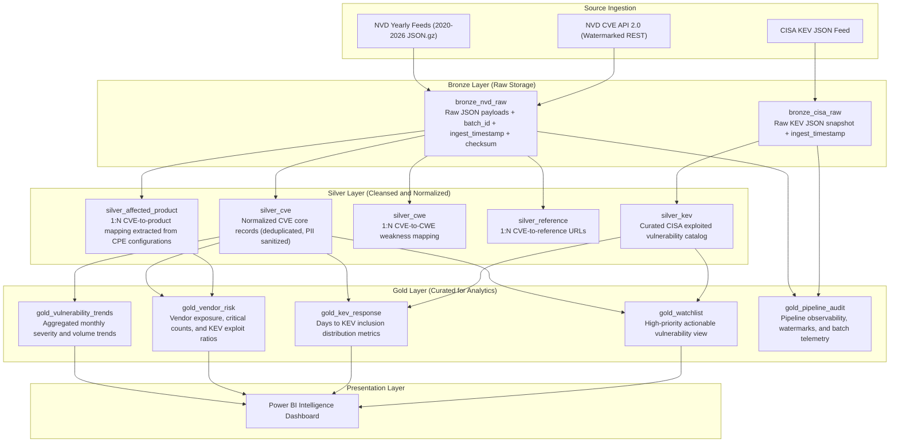

# VulnPulse Architecture Specification

This document provides technical reference for the VulnPulse Medallion Lakehouse pipeline, including schemas, transformations, and layer transitions implemented in Apache Spark.

## Medallion Data Flow

---

## 1. Bronze Layer (Raw Storage)

The Bronze layer preserves raw JSON payloads without schema alteration, appending operational lineage fields.

### `bronze_nvd_raw`
- **Grain:** One row per raw payload file or API response page.
- **Format:** Delta Lake.
- **Schema:**
  - `batch_id` (StringType): Unique identifier for ingestion run (UUID).
  - `load_type` (StringType): `FULL` or `INCREMENTAL`.
  - `source_uri` (StringType): URL or source filename.
  - `ingested_at` (TimestampType): UTC timestamp of landing.
  - `payload_sha256` (StringType): Hex digest of the payload.
  - `raw_json` (StringType): Complete unparsed JSON string.

### `bronze_cisa_raw`
- **Grain:** One row per snapshot capture of the CISA KEV catalog.
- **Format:** Delta Lake.
- **Schema:**
  - `batch_id` (StringType): Ingestion run identifier.
  - `catalog_version` (StringType): Version reported by CISA (e.g., `2026.09.24`).
  - `ingested_at` (TimestampType): UTC timestamp of capture.
  - `raw_json` (StringType): Complete JSON payload.

---

## 2. Silver Layer (Cleansed and Normalized)

The Silver layer unpacks nested JSON structures, standardizes data types, sanitizes identifying attributes, and deduplicates records.

### 2.1 `silver_cve`
- **Grain:** One row per CVE record.
- **Deduplication Strategy:** Window partitioned by `cve_id`, ordered by `last_modified_at DESC`.
- **Schema:**
  - `cve_id` (StringType, PK): Format `CVE-YYYY-[0-9]+`.
  - `published_at` (TimestampType): Disclosed date from NVD.
  - `last_modified_at` (TimestampType): Latest modification date.
  - `vuln_status` (StringType): Status (e.g., `Analyzed`, `Modified`).
  - `description_en` (StringType): Extracted English description (`descriptions[?(@.lang=='en')].value`).
  - `cvss_v3_score` (DoubleType): Derived base score from `cvssMetricV31` or `cvssMetricV30`.
  - `cvss_v3_severity` (StringType): `CRITICAL`, `HIGH`, `MEDIUM`, or `LOW`.
  - `cvss_vector` (StringType): CVSS vector string.
  - `has_source_identifier` (BooleanType): Lineage flag indicating submitter attribution was present.
  - `ingestion_batch_id` (StringType): Traceability to Bronze batch.

### 2.2 `silver_affected_product`
- **Grain:** One row per CVE to Product configuration.
- **Schema:**
  - `cve_id` (StringType, FK): References `silver_cve.cve_id`.
  - `vendor` (StringType): Parsed from CPE URI (part 3).
  - `product` (StringType): Parsed from CPE URI (part 4).
  - `version_criteria` (StringType): CPE string or version constraint.
  - `is_vulnerable` (BooleanType): Flag from configuration node.

### 2.3 `silver_cwe`
- **Grain:** One row per CVE to Weakness mapping.
- **Schema:**
  - `cve_id` (StringType, FK): References `silver_cve.cve_id`.
  - `cwe_id` (StringType): Identifier (e.g., `CWE-79`, `CWE-89`).

### 2.4 `silver_kev`
- **Grain:** One row per known exploited CVE.
- **Schema:**
  - `cve_id` (StringType, PK): References `silver_cve.cve_id`.
  - `vendor_project` (StringType): Vendor identifier from CISA.
  - `product` (StringType): Product identifier from CISA.
  - `vulnerability_name` (StringType): Descriptive vulnerability title.
  - `date_added` (DateType): Date added to CISA KEV catalog.
  - `due_date` (DateType): Federal remediation deadline.
  - `known_ransomware_campaign_use` (StringType): `Known` or `Unknown`.
  - `required_action` (StringType): Specific remediation instruction.

---

## 3. Gold Layer (Curated for Analytics)

The Gold layer aggregates data to answer specific business questions and powers Power BI visualizations.

### 3.1 `gold_vulnerability_trends`
- **Purpose:** Tracks reporting volume and severity breakdown over time.
- **Grain:** Year, Month, Severity.
- **Columns:** `year`, `month`, `cvss_v3_severity`, `cve_count`, `average_cvss_score`.

### 3.2 `gold_vendor_risk`
- **Purpose:** Identifies vendors with high vulnerability exposure and exploitation rates.
- **Grain:** Vendor.
- **Columns:** `vendor`, `total_cves`, `critical_cves`, `kev_exploited_cves`, `exploit_ratio`, `avg_cvss_score`.

### 3.3 `gold_kev_response`
- **Purpose:** Measures the duration between initial NVD disclosure and CISA KEV listing.
- **Grain:** `cve_id`.
- **Derived Metric:** `days_to_kev_inclusion = DATEDIFF(date_added, published_at)`.
- **Columns:** `cve_id`, `vendor`, `published_at`, `date_added`, `days_to_kev_inclusion`, `cvss_v3_score`, `known_ransomware_campaign_use`.

### 3.4 `gold_watchlist`
- **Purpose:** Filtered operational list of active threats requiring immediate action.
- **Inclusion Criteria:** Present in `silver_kev` OR (`cvss_v3_score >= 9.0` and published within last 90 days).
- **Columns:** `cve_id`, `vendor`, `product`, `severity`, `cvss_score`, `is_exploited`, `due_date`, `required_action`.

### 3.5 `gold_pipeline_audit`
- **Purpose:** Operational observability and watermark management.
- **Columns:** `batch_id`, `run_timestamp`, `load_type`, `records_ingested`, `records_written`, `records_rejected`, `watermark_timestamp`, `execution_time_seconds`.
