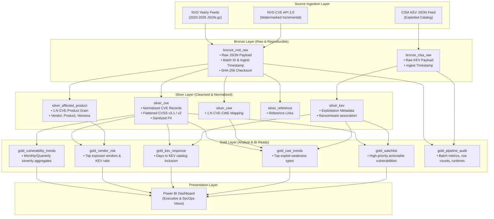

# VulnPulse Architecture Specification

## Overview

VulnPulse is a cybersecurity vulnerability intelligence Lakehouse engineered using **Apache Spark** and the **Medallion Architecture (Bronze $\rightarrow$ Silver $\rightarrow$ Gold)**. It ingests historical baseline vulnerabilities and near-real-time updates from the **National Vulnerability Database (NVD)** and enriches them with exploitation signals from the **CISA Known Exploited Vulnerabilities (KEV)** catalog.

---

## 1. Bronze Layer (Raw & Auditable)
- **Goal:** Ingest raw payloads with zero schema manipulation while capturing pipeline lineage.
- **Key Tables:**
  - `bronze_nvd_raw`: Stores raw CVE JSON objects, batch ID, load type (`FULL` or `INCREMENTAL`), ingestion timestamp, and source hash.
  - `bronze_cisa_raw`: Stores raw CISA KEV JSON documents with catalog snapshot metadata.

---

## 2. Silver Layer (Cleaned, Flattened & Normalized)
- **Goal:** Unpack deeply nested JSON structures, sanitize PII, deduplicate records using `lastModified` watermarks, and normalize relationships.
- **Data Models:**
  - **`silver_cve`**:
    - Grain: One record per CVE.
    - Fields: `cve_id`, `published_at`, `last_modified_at`, `vuln_status`, `description_en`, `cvss_v3_score`, `cvss_v3_severity`, `cvss_vector`, `primary_cwe_id`.
    - PII Handling: Drop `sourceIdentifier` values containing email structures; retain flag `has_source_identifier`.
  - **`silver_affected_product`**:
    - Grain: One record per CVE $\times$ Product relationship.
    - Fields: `cve_id`, `vendor`, `product`, `version_start_including`, `version_end_excluding`, `vulnerable_flag`.
  - **`silver_cwe`**:
    - Grain: One record per CVE $\times$ Weakness identifier.
    - Fields: `cve_id`, `cwe_id`.
  - **`silver_kev`**:
    - Grain: One record per known exploited CVE.
    - Fields: `cve_id`, `vendor_project`, `product`, `date_added`, `due_date`, `known_ransomware_campaign_use`, `required_action`.

---

## 3. Gold Layer (Business Intelligence Ready)
- **Goal:** Provide high-performance aggregated and modeled datasets answering core security operations questions.
- **Aggregated Tables:**
  - **`gold_vulnerability_trends`**: Monthly counts broken down by CVSS severity tiers (Critical, High, Medium, Low).
  - **`gold_vendor_risk`**: Vendor exposure rankings calculating total CVE count, critical CVE count, and active KEV percentage.
  - **`gold_kev_response`**: Calculation of `days_to_kev_inclusion = date_added (CISA) - published_at (NVD)` to measure latency in recognizing active exploits.
  - **`gold_cwe_trends`**: Most frequent root-cause weakness categories associated with exploited vs unexploited vulnerabilities.
  - **`gold_watchlist`**: Filtered list of zero-day/exploited vulnerabilities requiring urgent patch action.
  - **`gold_pipeline_audit`**: Batch execution telemetry, tracking ingested counts, rejected rows, file sizes, and watermark progressions.
