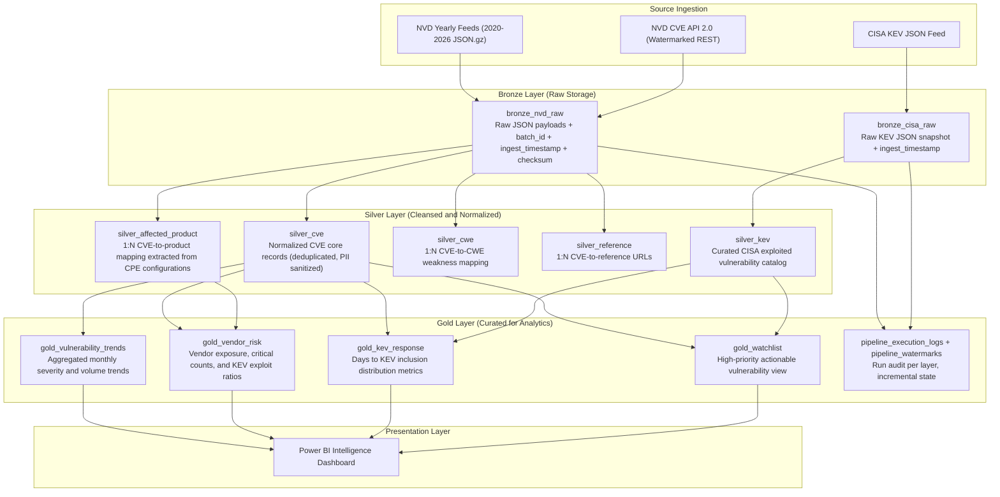

# VulnPulse Architecture Specification

This document provides technical reference for the VulnPulse Medallion Lakehouse pipeline, including schemas, transformations, and layer transitions implemented in Apache Spark.

## Medallion Data Flow

```mermaid
flowchart TD
    subgraph Ingestion ["Source Ingestion"]
        NVD_Full["NVD Yearly Feeds (2020-2026 JSON.gz)"]
        NVD_Inc["NVD CVE API 2.0 (Watermarked REST)"]
        CISA_Feed["CISA KEV JSON Feed"]
    end

    subgraph Bronze ["Bronze Layer (Raw Storage)"]
        B_NVD["bronze_nvd_raw<br/>Raw JSON payloads + batch_id + ingest_timestamp + checksum"]
        B_CISA["bronze_cisa_raw<br/>Raw KEV JSON snapshot + ingest_timestamp"]
    end

    subgraph Silver ["Silver Layer (Cleansed and Normalized)"]
        S_CVE["silver_cve<br/>Normalized CVE core records (deduplicated, PII sanitized)"]
        S_Prod["silver_affected_product<br/>1:N CVE-to-product mapping extracted from CPE configurations"]
        S_CWE["silver_cwe<br/>1:N CVE-to-CWE weakness mapping"]
        S_Ref["silver_reference<br/>1:N CVE-to-reference URLs"]
        S_KEV["silver_kev<br/>Curated CISA exploited vulnerability catalog"]
    end

    subgraph Gold ["Gold Layer (Curated for Analytics)"]
        G_Trend["gold_vulnerability_trends<br/>Aggregated monthly severity and volume trends"]
        G_Vendor["gold_vendor_risk<br/>Vendor exposure, critical counts, and KEV exploit ratios"]
        G_KEV_Resp["gold_kev_response<br/>Days to KEV inclusion distribution metrics"]
        G_Watch["gold_watchlist<br/>High-priority actionable vulnerability view"]
        G_Audit["pipeline_execution_logs + pipeline_watermarks<br/>Run audit per layer, incremental state"]
    end

    subgraph Presentation ["Presentation Layer"]
        PowerBI["Power BI Intelligence Dashboard"]
    end

    NVD_Full --> B_NVD
    NVD_Inc --> B_NVD
    CISA_Feed --> B_CISA

    B_NVD --> S_CVE
    B_NVD --> S_Prod
    B_NVD --> S_CWE
    B_NVD --> S_Ref
    B_CISA --> S_KEV

    S_CVE --> G_Trend
    S_CVE & S_Prod --> G_Vendor
    S_CVE & S_KEV --> G_KEV_Resp
    S_CVE & S_KEV --> G_Watch
    B_NVD & B_CISA --> G_Audit

    G_Trend --> PowerBI
    G_Vendor --> PowerBI
    G_KEV_Resp --> PowerBI
    G_Watch --> PowerBI
```

---

## 1. Bronze Layer (Raw Storage)

The Bronze layer preserves every source record **verbatim** and appends ingestion lineage. It is
append-only: nothing in Bronze is ever updated or deleted, so any Silver state can be rebuilt from it.

**Implementation note (Phase 2).** The Phase 1 proposal described Bronze as one row per API page or
feed file. The implemented grain is **one row per source record**. Reason: a yearly NVD feed is a
single 50 MB JSON object; storing it as one row forces Silver to parse one giant string in one task
and gives `MERGE` no natural key. Per-record rows keep raw preservation, give Silver a key
(`cve_id`), and let the watermark be computed from a plain column. Everything else in the approved
design is unchanged.

**How raw preservation and explicit schemas coexist.** Files are read with an explicit
`StructType` (`NVD_PAGE_RAW_SCHEMA`, `KEV_CATALOG_RAW_SCHEMA`) in which the page envelope is typed
and each record field is declared `StringType`. Spark's JSON reader copies an object into a
`StringType` field as its JSON text, so every source key survives, including ones the typed schema
does not model yet. Schema inference is never used.

### `bronze_nvd_raw` (`workspace.vulnpulse_bronze`)
- **Grain:** One row per CVE record per batch.
- **Primary key:** (`cve_id`, `batch_id`).
- **Format:** Delta Lake, append-only.

| Column | Type | Description |
|---|---|---|
| `cve_id` | STRING, not null | `$.id` lifted from the record for keys and filters |
| `source_last_modified` | STRING | `$.lastModified` as emitted by NVD; drives the watermark. Cast in Silver |
| `raw_json` | STRING, not null | The complete CVE object exactly as received |
| `payload_sha256` | STRING, not null | SHA-256 of `raw_json`; identical input yields identical hash |
| `source_uri` | STRING, not null | Feed file path or the API request URL for the window |
| `load_type` | STRING, not null | `FULL`, `INCREMENTAL` or `BACKFILL` |
| `batch_id` | STRING, not null | Run identifier, time-prefixed (`20261009T101500Z-ab12cd34`) |
| `load_timestamp` | TIMESTAMP, not null | UTC instant the batch started; same for every row of a batch |

### `bronze_cisa_raw` (`workspace.vulnpulse_bronze`)
- **Grain:** One row per KEV catalog entry per snapshot.
- **Primary key:** (`cve_id`, `batch_id`).
- **Format:** Delta Lake, append-only. Every run is a FULL snapshot; CISA offers no incremental API.

| Column | Type | Description |
|---|---|---|
| `cve_id` | STRING, not null | `$.cveID` lifted from the entry |
| `catalog_version` | STRING | CISA catalog version, e.g. `2026.09.24` |
| `date_released` | STRING | Catalog release timestamp as emitted |
| `raw_json` | STRING, not null | The complete KEV entry exactly as received |
| `payload_sha256` | STRING, not null | SHA-256 of `raw_json` |
| `source_uri` | STRING, not null | Feed URL or file path |
| `load_type` | STRING, not null | Always `FULL` |
| `batch_id` | STRING, not null | Run identifier |
| `load_timestamp` | TIMESTAMP, not null | UTC instant the batch started |

### Landing volume `workspace.vulnpulse_bronze.landing`
Free Edition serverless has no outbound internet, so files arrive here from a laptop:
`scripts/fetch_nvd.py` / `scripts/fetch_kev.py` write `nvd/<batch_id>/page_*.json` or
`kev/<batch_id>/known_exploited_vulnerabilities.json` plus a `manifest.json` (window start/end, load
type, source URL, batch id, record count). The folder is uploaded through Catalog Explorer, read into
Bronze by the notebook, then deleted once the append succeeded (FinOps rule). Yearly feed files for the
historical FULL load are uploaded the same way.

---

## 2. Silver Layer (Cleansed and Normalized)

The Silver layer unpacks nested JSON structures, standardizes data types, sanitizes identifying attributes, and deduplicates records.

**Phase 2 scope:** `silver_cve` and `silver_kev`, plus a `silver_quarantine` table for records that
cannot be conformed. `silver_affected_product`, `silver_cwe` and `silver_reference` follow in Phase 3.
Every Silver row additionally carries `load_timestamp` (UTC, when the row was merged) and
`batch_id` (the Bronze batch it came from), as required by the Phase 2 rubric. Silver is written
with `MERGE INTO` keyed on `cve_id`, after deduplicating on the latest `last_modified_at`, and is
parsed from `raw_json` with the typed `NVD_CVE_SCHEMA` / `KEV_RECORD_SCHEMA`.

### 2.1 `silver_cve`
- **Grain:** One row per CVE. **Primary key:** `cve_id`.
- **Source:** `bronze_nvd_raw.raw_json`, parsed with `NVD_CVE_SCHEMA` (nested arrays) and `get_json_object` (top-level scalars, so a type change in one nested field cannot null the record).
- **Deduplication:** window on `cve_id` ordered by `last_modified_at DESC`, then `batch_id DESC`, `payload_sha256 DESC` as deterministic tie-breakers.
- **MERGE:** `ON t.cve_id = s.cve_id`; `WHEN MATCHED AND s.last_modified_at > t.last_modified_at THEN UPDATE`; `WHEN NOT MATCHED THEN INSERT`.

| Column | Type | Derivation |
|---|---|---|
| `cve_id` | STRING, not null | Bronze `cve_id` (`$.id`), trimmed; must match `^CVE-\d{4}-\d{4,}$` |
| `published_at` | TIMESTAMP | `$.published`, UTC, format `yyyy-MM-dd'T'HH:mm:ss[.SSS]` |
| `last_modified_at` | TIMESTAMP | `$.lastModified`, same parsing |
| `vuln_status` | STRING | `$.vulnStatus` (e.g. `Analyzed`, `Modified`, `Received`) |
| `description_en` | STRING | First `descriptions[]` entry with `lang = 'en'` |
| `cvss_v3_score` | DOUBLE | Base score of the `Primary` entry of `cvssMetricV31`, else its first entry, else the same from `cvssMetricV30`; a stringified score is cast with `try_cast` |
| `cvss_v3_severity` | STRING | Matching `baseSeverity`, upper-cased |
| `cvss_vector` | STRING | Matching `vectorString` |
| `has_source_identifier` | BOOLEAN | `$.sourceIdentifier IS NOT NULL`; the identifier itself is never stored (PII rule) |
| `payload_sha256` | STRING | Bronze hash of the winning raw record (lineage) |
| `batch_id` | STRING, not null | Bronze batch the winning record came from |
| `load_timestamp` | TIMESTAMP, not null | UTC start time of the Silver run that last wrote the row |

### 2.2 `silver_affected_product`
- **Grain:** One row per CVE to Product configuration.
- **Schema:**
  - `cve_id` (StringType, FK): References `silver_cve.cve_id`.
  - `vendor` (StringType): Parsed from CPE URI (part 3).
  - `product` (StringType): Parsed from CPE URI (part 4).
  - `version_criteria` (StringType): CPE string or version constraint.
  - `is_vulnerable` (BooleanType): Flag from configuration node.

### 2.3 `silver_cwe`
- **Grain:** One row per CVE to Weakness mapping.
- **Schema:**
  - `cve_id` (StringType, FK): References `silver_cve.cve_id`.
  - `cwe_id` (StringType): Identifier (e.g., `CWE-79`, `CWE-89`).

### 2.4 `silver_kev`
- **Grain:** One row per known exploited CVE. **Primary key:** `cve_id`.
- **Source:** `bronze_cisa_raw.raw_json`, parsed with `KEV_RECORD_SCHEMA`.
- **Deduplication:** window on `cve_id` ordered by `catalog_version DESC`, `batch_id DESC`, `payload_sha256 DESC` (KEV has no modification timestamp).
- **MERGE:** update a matched row only when `s.payload_sha256 <> t.payload_sha256 AND s.catalog_version >= t.catalog_version`.

| Column | Type | Derivation |
|---|---|---|
| `cve_id` | STRING, not null | `$.cveID`; references `silver_cve.cve_id` |
| `vendor_project` | STRING | `$.vendorProject` |
| `product` | STRING | `$.product` |
| `vulnerability_name` | STRING | `$.vulnerabilityName` |
| `date_added` | DATE | `$.dateAdded` (`yyyy-MM-dd`) |
| `due_date` | DATE | `$.dueDate` (`yyyy-MM-dd`) |
| `known_ransomware_campaign_use` | STRING | `Known` or `Unknown` |
| `required_action` | STRING | `$.requiredAction` |
| `catalog_version` | STRING | Bronze `catalog_version` (e.g. `2026.10.04`) |
| `payload_sha256` | STRING | Bronze hash (lineage) |
| `batch_id` | STRING, not null | Bronze batch |
| `load_timestamp` | TIMESTAMP, not null | UTC start time of the Silver run |

### 2.5 `silver_quarantine`
- **Grain:** One row per rejected Bronze record per reason. **Primary key:** (`source_table`, `batch_id`, `payload_sha256`, `reason`); written with an insert-only `MERGE`, so re-runs never duplicate it.
- **Columns:** `source_table` STRING, `cve_id` STRING (nullable: a missing id is a reason), `reason` STRING, `raw_json` STRING, `payload_sha256` STRING, `batch_id` STRING, `load_timestamp` TIMESTAMP.
- **Reasons:** `missing_cve_id`, `invalid_cve_id_format`, `unparseable_published`, `unparseable_last_modified` (NVD), `unparseable_date_added` (KEV). Rules are checked in that order; the first one broken is recorded.

### 2.6 Schema drift
- A new top-level source field is preserved in Bronze `raw_json` and listed per run in the audit row's `parameters.schema_drift_keys` (compared against `NVD_CVE_KNOWN_KEYS` / `KEV_KNOWN_KEYS`). The run does not fail.
- A changed type (e.g. a score sent as a string) is absorbed by `try_` casts; if the value still cannot be conformed and the field is required, the record is quarantined.

---

## 3. Gold Layer (Curated for Analytics)

The Gold layer aggregates data to answer specific business questions and powers Power BI visualizations.

### 3.1 `gold_vulnerability_trends`
- **Purpose:** Tracks reporting volume and severity breakdown over time.
- **Grain:** Year, Month, Severity.
- **Columns:** `year`, `month`, `cvss_v3_severity`, `cve_count`, `average_cvss_score`.

### 3.2 `gold_vendor_risk`
- **Purpose:** Identifies vendors with high vulnerability exposure and exploitation rates.
- **Grain:** Vendor.
- **Columns:** `vendor`, `total_cves`, `critical_cves`, `kev_exploited_cves`, `exploit_ratio`, `avg_cvss_score`.

### 3.3 `gold_kev_response`
- **Purpose:** Measures the duration between initial NVD disclosure and CISA KEV listing.
- **Grain:** `cve_id`.
- **Derived Metric:** `days_to_kev_inclusion = DATEDIFF(date_added, published_at)`.
- **Columns:** `cve_id`, `vendor`, `published_at`, `date_added`, `days_to_kev_inclusion`, `cvss_v3_score`, `known_ransomware_campaign_use`.

### 3.4 `gold_watchlist`
- **Purpose:** Filtered operational list of active threats requiring immediate action.
- **Inclusion Criteria:** Present in `silver_kev` OR (`cvss_v3_score >= 9.0` and published within last 90 days).
- **Columns:** `cve_id`, `vendor`, `product`, `severity`, `cvss_score`, `is_exploited`, `due_date`, `required_action`.

### 3.5 Operational tables (`workspace.vulnpulse_gold`)

Replaces the proposed `gold_pipeline_audit` with two narrower tables, named to match the Phase 2
rubric's wording. Both are written by every layer with the same schema module.

#### `pipeline_execution_logs`
One row per run per layer, written in a `finally` block so failed runs are logged too.

| Column | Type | Description |
|---|---|---|
| `batch_id` | STRING | Run identifier shared with the data rows it produced |
| `layer` | STRING | `Raw-to-Bronze` or `Bronze-to-Silver` |
| `source` | STRING | File path, API URL with window, or source table processed |
| `load_type` | STRING | `FULL`, `INCREMENTAL`, `BACKFILL` |
| `parameters` | STRING | JSON of every parameter the run received |
| `started_at`, `finished_at` | TIMESTAMP | UTC |
| `status` | STRING | `SUCCESS` or `FAILURE` |
| `rows_read`, `rows_inserted`, `rows_updated`, `rows_quarantined` | BIGINT | Audit metrics |
| `error_message` | STRING | Exception type and message on failure |
| `load_timestamp` | TIMESTAMP | UTC, equals `finished_at` |

#### `pipeline_watermarks`
Append-only history of the incremental high-water mark per source; the current value is
`max(watermark_ts)`.

| Column | Type | Description |
|---|---|---|
| `source` | STRING | `nvd_cve_api` |
| `watermark_ts` | TIMESTAMP | Largest source `lastModified` landed by a successful INCREMENTAL run |
| `batch_id` | STRING | The run that advanced it |
| `load_timestamp` | TIMESTAMP | UTC |
